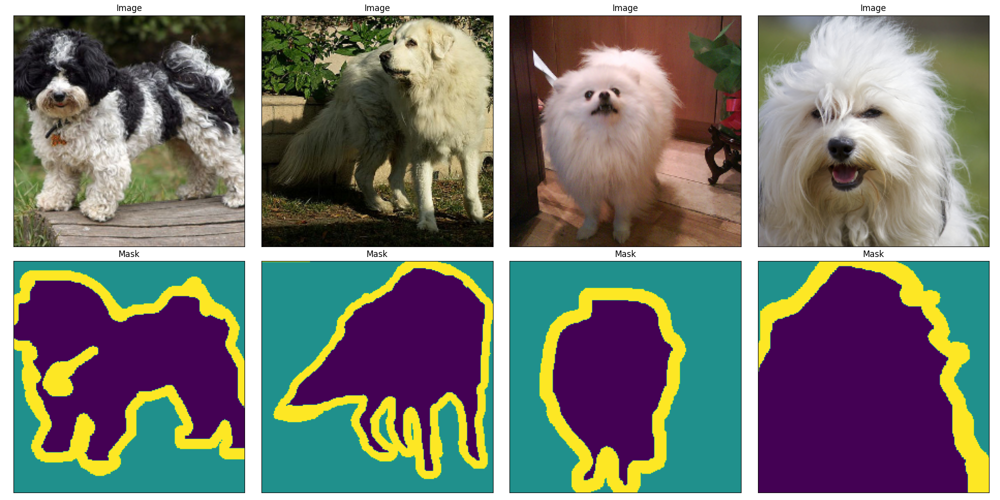

# Image Segmentation with UNet on The Oxford-IIIT Pet Dataset

This repository contains a deep learning model for image segmentation using a UNet architecture on The Oxford-IIIT Pet Dataset. The model is trained to segment images of pets into foreground and background regions.

## Installation

### Downloading the Dataset

Follow this [link](https://www.robots.ox.ac.uk/~vgg/data/pets/) to download `images.tar.gz` and `annotations.tar.gz` from the Oxford-IIIT Pet Dataset. Extract the files into the `data/` folder. You can see the folder structure below in the [Folder Structure](#folder-structure) section.

### Python Packages

To install the required packages, run the following command:

```bash
pip install -r requirements.txt
```

## Dataset Overview

The Oxford-IIIT Pet Dataset contains images of cats and dogs with corresponding ground truth segmentation masks. The dataset consists of 37 categories, with about 200 images for each category. The dataset can be downloaded from the [official website](https://www.robots.ox.ac.uk/~vgg/data/pets/).

To view some samples inside the dataset, run the `data_visualization.py` script. The script will load the dataset and display a random sample of images and segmentation masks.

Some examples of the dataset with segmentation masks are shown below.



## Folder Structure

```
./
├── data/
│   ├── annotations         # contains the ground truth segmentation masks
│   └── images              # contains the images
|
├── models/
│   ├── checkpoint.pth
│   └── config.json
|
├── src/
│   ├── __init.py__
|   ├── augmentations.py
│   ├── dataset.py
│   ├── model.py
│   └── utils.py
|
├── .gitignore
├── config.yaml             # configuration file
├── data_visualization.py
├── LICENSE
├── predict.py              # prediction script
├── README.md               # this file
├── st_app.py               # streamlit app
└── train.py                # training script
```

To train the model, you can extract the dataset into the `data/` folder and run the `train.py` script. The model will be saved in the `models/` folder.

## Model

The image segmentation model is based on a UNet architecture, which consists of an encoder to downsample the input image and a decoder to upsample the encoded features to the original image size. The model is implemented using PyTorch and trained on the preprocessed dataset using stochastic gradient descent with backpropagation. The model is designed to predict a multi-class segmentation mask for each input image.

### Model Architecture

The model consists of an encoder and decoder with skip connections to retain spatial information.


-   The encoder includes multiple convolutional layers with max pooling to downsample the input image and extract high-level features.

-   The decoder includes multiple transpose convolutional layers to upsample the encoded features and produce a binary mask.

-   The bottleneck layer is a convolutional layer in the bottom of the figure.

-   The skip connections between the encoder and decoder layers allow the model to retain spatial information and improve segmentation accuracy.

The implementation of the model is based on the PyTorch implementation of the UNet architecture by Aladdin Persson [1].

### Model Training and Evaluation

The model is trained for `200` epochs with a batch size of `32` and an initial learning rate of `3e-4`.

You can train the model by running the `train.py` script.
The configuration file `config.yaml` contains the hyperparameters for the model training.

### Demo

To run a demo of the image segmentation model, run the `predict.py` script. The script loads the trained model weights and applies the segmentation model to a specified image. The script will save the input image and the predicted segmentation mask in the `results/` folder.

## References

[1] Aladdin Persson. "PyTorch Image Segmentation Tutorial with U-NET: everything from scratch baby". [YouTube link](https://www.youtube.com/watch?v=IHq1t7NxS8k).

[2] Johannes Schmidt. "Creating and training a U-Net model with PyTorch for 2D & 3D semantic segmentation: Model building [2/4]." [Medium](https://towardsdatascience.com/creating-and-training-a-u-net-model-with-pytorch-for-2d-3d-semantic-segmentation-model-building-6ab09d6a0862).
